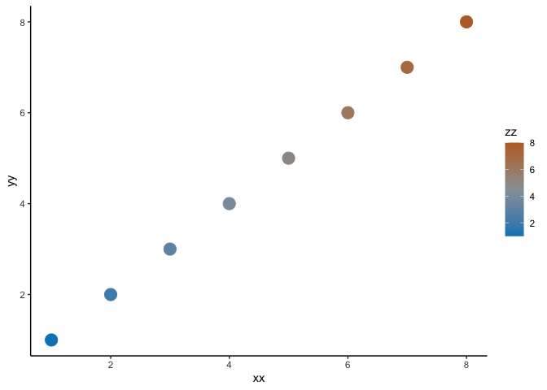

# Bird Color Palettes (made with 100% REAL birds!)

## Install

``` r
devtools::install_github("bentonelli/birdcolors")
```

## Basic Use

### See what birds are being served today

``` r
library(birdcolors)
library(ggplot2)

bird_menu()
```

    ##                       bird_names ncols
    ## 1                Scarlet_Tanager     2
    ## 2                 Indigo_Bunting     2
    ## 3                   Pine_Warbler     2
    ## 4                  Varied_Thrush     2
    ## 5                 Cassin_s_Finch     2
    ## 6                   Barn_Swallow     2
    ## 7                 Lazuli_Bunting     3
    ## 8            Allen_s_Hummingbird     3
    ## 9          Thick_billed_Euphonia     3
    ## 10          Yellow_headed_Amazon     3
    ## 11           Costa_s_Hummingbird     3
    ## 12             Belted_Kingfisher     4
    ## 13       Gray_crowned_Rosy_finch     4
    ## 14              Elegant_Euphonia     4
    ## 15              Paradise_Tanager     5
    ## 16            European_Goldfinch     6
    ## 17 Black_backed_Dwarf_Kingfisher     6
    ## 18                 Scarlet_Macaw     7
    ## 19           Scaly_Ground_Roller     8
    ## 20                     Wood_Duck     9

### Plotting with Base R

``` r
# Base R
outp <- bird_colors("Scarlet Macaw")
xx <- (1:7)
yy <- (1:7)
zz <- (1:7)

plot(xx,yy,col=outp[zz],pch=19,cex=2)
```


### Plotting with ggplot

``` r
# ggplot2
bird_cols <- bird_colors("Lazuli Bunting",reverse=TRUE)

xx <- (1:8)
yy <- (1:8)
zz <- (1:8)

ggplot() +
  geom_point(aes(x = xx,y=yy,col=zz),pch=19,cex=5) +
  scale_color_bird(bird_cols) +
  theme_classic()
```


