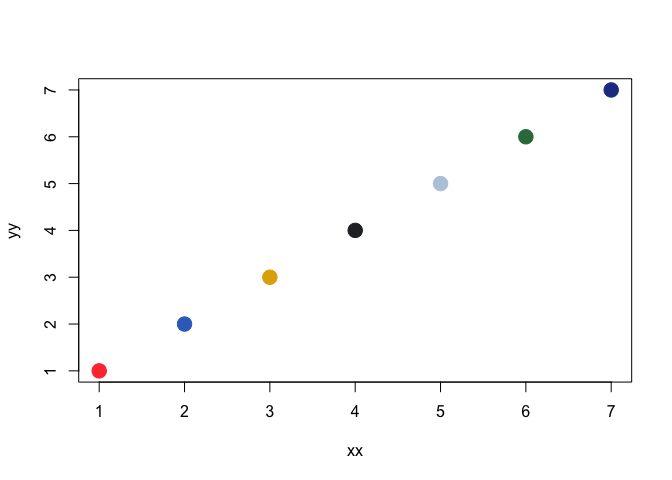
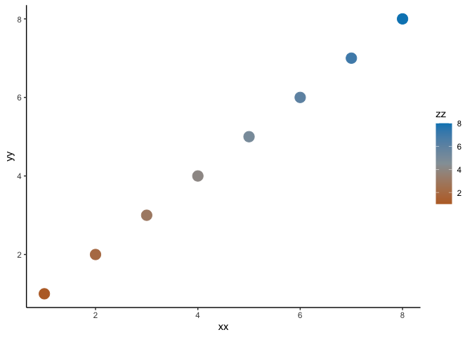

# Bird Color Palettes (made with 100% REAL birds!)

## Install

``` r
#devtools::install_github("bentonelli/birdcolors")
```

## Basic Use

``` r
library(birdcolors)
library(ggplot2)

# Base R
outp <- bird_colors("Scarlet Macaw")
xx <- (1:7)
yy <- (1:7)
zz <- (1:7)

plot(xx,yy,col=outp[zz],pch=19)
```



``` r
# ggplot2
bird_cols <- bird_colors("Lazuli Bunting")

xx <- (1:8)
yy <- (1:8)
zz <- (1:8)

ggplot() +
  geom_point(aes(x = xx,y=yy,col=zz),pch=19,cex=5) +
  scale_color_bird(bird_cols) +
  theme_classic()
```



This is an R Markdown document. Markdown is a simple formatting syntax
for authoring HTML, PDF, and MS Word documents. For more details on
using R Markdown see <http://rmarkdown.rstudio.com>.

When you click the **Knit** button a document will be generated that
includes both content as well as the output of any embedded R code
chunks within the document. You can embed an R code chunk like this:

``` r
summary(cars)
```

    ##      speed           dist       
    ##  Min.   : 4.0   Min.   :  2.00  
    ##  1st Qu.:12.0   1st Qu.: 26.00  
    ##  Median :15.0   Median : 36.00  
    ##  Mean   :15.4   Mean   : 42.98  
    ##  3rd Qu.:19.0   3rd Qu.: 56.00  
    ##  Max.   :25.0   Max.   :120.00

## Including Plots

You can also embed plots, for example:


Note that the `echo = FALSE` parameter was added to the code chunk to
prevent printing of the R code that generated the plot.
