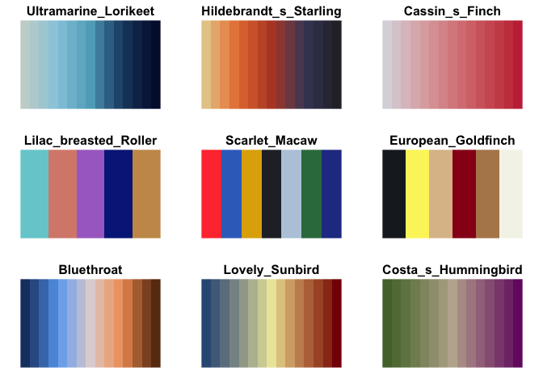
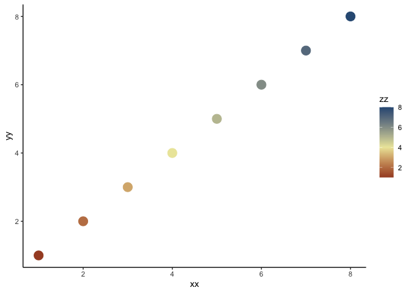

# Bird Color Palettes (made with 100% REAL birds!)

<figure>

<figcaption aria-hidden="true">devel 0.0.5</figcaption>
</figure>

birdcolors is a palette generator to spice up your scientific plots (and
maybe your life) using the diversity of colors observed across the birds
of the world.

Cite us: Tonelli, B.A. (2025) birdcolors: A palette generator of bird
colors. R package version 0.0.5

## Install

``` r
devtools::install_github("bentonelli/birdcolors")
```

## Basic Use

### See what birds are being served today

``` r
library(birdcolors)
library(ggplot2)

bird_menu()
```

    ##                       bird_names ncols
    ## 1                Scarlet_Tanager     2
    ## 2                 Indigo_Bunting     2
    ## 3                   Pine_Warbler     2
    ## 4                  Varied_Thrush     2
    ## 5                 Cassin_s_Finch     2
    ## 6                   Barn_Swallow     2
    ## 7                 Lazuli_Bunting     3
    ## 8            Allen_s_Hummingbird     3
    ## 9          Thick_billed_Euphonia     3
    ## 10          Yellow_headed_Amazon     3
    ## 11           Costa_s_Hummingbird     3
    ## 12       Andean_Cock_of_the_Rock     3
    ## 13                    Bluethroat     3
    ## 14                Lovely_Sunbird     3
    ## 15              Curl_crested_Jay     3
    ## 16             Northern_Shoveler     3
    ## 17             Belted_Kingfisher     4
    ## 18       Gray_crowned_Rosy_finch     4
    ## 19              Elegant_Euphonia     4
    ## 20        Black_spotted_Bare_eye     4
    ## 21              Paradise_Tanager     5
    ## 22         Hairy_crested_Antbird     5
    ## 23            European_Goldfinch     6
    ## 24 Black_backed_Dwarf_Kingfisher     6
    ## 25                    Blue_Pitta     6
    ## 26                 Scarlet_Macaw     7
    ## 27           Scaly_Ground_Roller     8
    ## 28                     Wood_Duck     9

### Plotting with Base R

``` r
# Base R
outp <- bird_colors("Scarlet Macaw")
xx <- (1:7)
yy <- (1:7)
zz <- (1:7)

plot(xx,yy,col=outp[zz],pch=19,cex=2)
```



### Plotting with ggplot

``` r
# ggplot2
bird_cols <- bird_colors("Lovely Sunbird",reverse=TRUE)

xx <- (1:8)
yy <- (1:8)
zz <- (1:8)

ggplot() +
  geom_point(aes(x = xx,y=yy,col=zz),pch=19,cex=5) +
  scale_color_bird(bird_cols,midpoint=4) +
  theme_classic()
```


