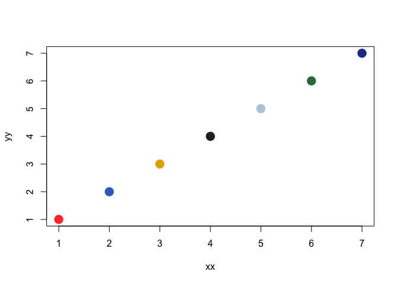
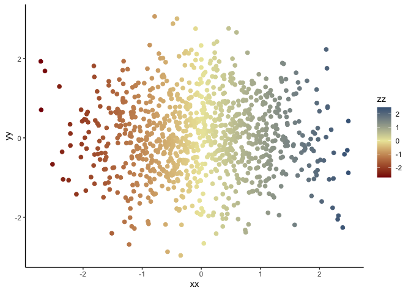

# Bird Color Palettes (made with 100% REAL birds!)

birdcolors is a palette generator to spice up your scientific plots (and
maybe your life) using the diversity of colors observed across the birds
of the world.

Cite us: Tonelli, B.A. (2025) birdcolors: A palette generator of bird
colors. R package version 0.0.5

## Install

``` r
devtools::install_github("bentonelli/birdcolors")
```

## Basic Use

### See what birds are being recommended today

``` r
library(birdcolors)
library(ggplot2)

#Get recommended birds - visually appealing and colorblind friendly!
bird_menu("rec")
```

    ##                bird_names ncols recommended
    ## 37  Lilac_breasted_Roller     5    Discrete
    ## 47     European_Goldfinch     6    Discrete
    ## 51          Scarlet_Macaw     7    Discrete
    ## 15    Costa_s_Hummingbird     3   Diverging
    ## 17         Lovely_Sunbird     3   Diverging
    ## 44             Bluethroat     5   Diverging
    ## 5          Cassin_s_Finch     2  Sequential
    ## 42   Ultramarine_Lorikeet     5  Sequential
    ## 43 Hildebrandt_s_Starling     5  Sequential

``` r
#For all available birds, use: bird_menu("all")
```

### Visualize these recommended palettes

``` r
bird_palette_visualizer(all_or_rec = "rec",pdf_plot = FALSE)
```


### Plotting discrete colors with base R

``` r
# Base R

#Use the bird colors function to load in your favorite bird's colors.
outp <- bird_colors("Scarlet Macaw")


xx <- (1:7)
yy <- (1:7)
zz <- (1:7)

plot(xx,yy,col=outp[zz],pch=19,cex=2)
```



### Plotting with ggplot

``` r
# ggplot2
bird_cols <- bird_colors("Lovely Sunbird",reverse=TRUE)

xx <- rnorm(1000,0,1)
yy <- rnorm(1000,0,1)
zz <- xx

ggplot() +
  geom_point(aes(x = xx,y=yy,col=zz),pch=19,cex=2) +
  scale_color_bird(bird_cols,midpoint=0) +
  theme_classic()
```


